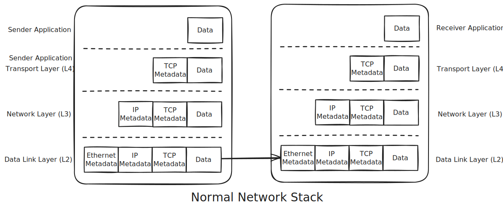
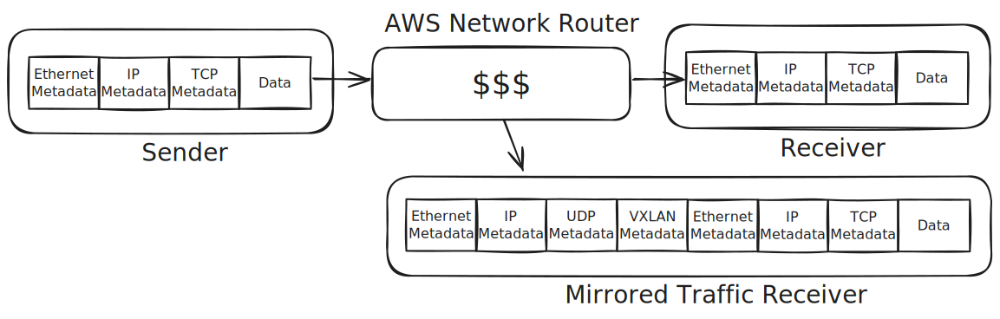

# VXLAN To HTTP Forwarder

This service can receive mirror traffic over a VXLAN and forward all traffic
to a given HTTP endpoint.

This is specifically used for [AWS Traffic
Mirroring](https://docs.aws.amazon.com/vpc/latest/mirroring/traffic-mirroring-packet-formats.html),
which sends us packets in this format. When you configure the traffic mirror
session, make sure the VNI matches the VNI that you pass to this service.

## Usage

```txt
Usage: vxlan-to-http <interface> <vni> <original_destination_port> <forward_addr>
```

Listens on a given network `<interface>` for mirror traffic. Only traffic
traffic with the given `<vni>` and sent to `<original_destination_port>` on
the original service that this is mirrored from will be forwarded (so
`<original_destination_port>` for example may be the port your service is
listening on behind the load balancer). Traffic will be forwarded to
`<forward_addr>`.

Set `MAX_PENDING_PACKETS` to configure how many packets to buffer when we
receive packets out of order. Since the mirror transfer protocol is UDP, we
have no way to get missing data if packets are dropped, so this probably
shouldn't be very high.

Set `MAX_RETRIES` to configure how many times to retry on `EWOULDBLOCK` before
giving up, since we use a non blocking TCP connection.

## Concepts



In an normal networking stack, each layer adds whatever metadata it needs to
run the network protocol.

TCP is responsible for retries and ensuring packets are received in order, so
the TCP metadata includes things like sequence numbers. TCP also includes the
port number, since TCP is what creates the abstraction of a connection.

IP is responsible for delivering the packet to the right host, so IP metadata
includes the source and destination IP addresses.

Ethernet is responsible for transferring the data on the physical medium, so
it includes information like the hardware MAC addresses.

On the other end, each layer of the network stack in the receiving host can
unwrap each layer of metadata, and each layer of metadata will explain how
this packet should be handled.



For traffic mirroring, AWS has fancy and expensive internal routers that can
mirror network traffic. It does this at the Ethernet layer using VXLAN, which
is another layer of protocol that allows you to simulate multiple virtual
Ethernet networks over the same physical infrastructure, differentiating them
using a Virtual Network Identifier (VNI) number.

The VXLAN metadata gets added on to the original packet. At this point we are
back to the case of the normal network stack, with this VXLAN metadata plus
our original packet as the data.

This whole package gets sent to us via UDP. UDP is at the same layer as TCP,
so just like with TCP, we also need to add the IP and Ethernet metadata to
send it over the network out our replay service.

This results in the monstrous packet shown in the diagram.

While TCP handles connections and retries, attempting to provide a smooth
experience for callers, UDP is completely stateless. UDP only sends the
packets once and hopes they arrive. There is no concept of a "connection" in
UDP.

This means that the "source port" of UDP is unused, because the receiver
couldn't send data back anyway. Since this is unused, the designers of this
mirror protocol chose to store a "5-tuple hash" in that field, which is a hash
of `(tcp_source_port, tcp_source_ip, tcp_destination_port, tcp_destination_ip,
protocol_number)` from the original packet. This is a convenient key for
differentiating between different sessions in the original traffic.

When we finally receive this packet, we must unwrap every field, one at a
time, until we have all the information we need. Then we can create new
connections to the target, and forward the original data on new TCP
connections, attempting to preserve the ordering of packets in the original
stream.
